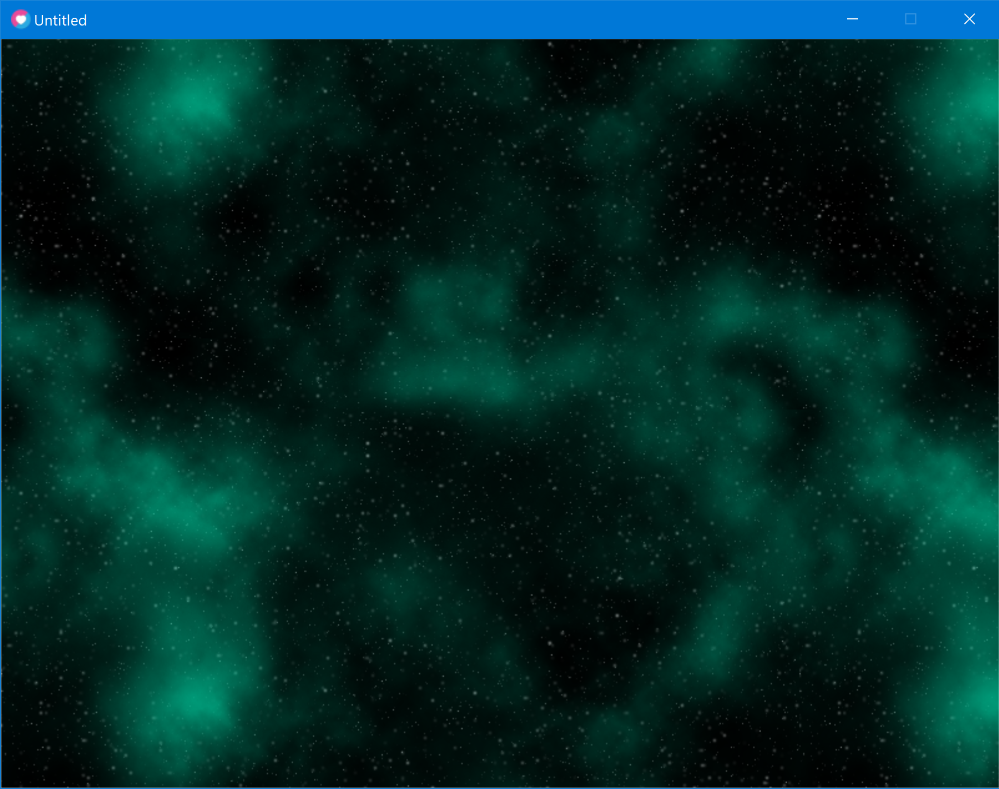

# Parallax-Background

A space background that parallax's in all directions

## What this has:
- 1 to many parallaxing layers and variable speeds
- background images that has pixel perfect tiling

## Controls:
- movement - wsad

## How to create pixel perfect tiling backgrounds:
- Create the background
- Split the image into into two vertical halves, swap them and make the new image centre look nice
- Split the image into into two horizontal halves, swap them and make the new image centre look nice

